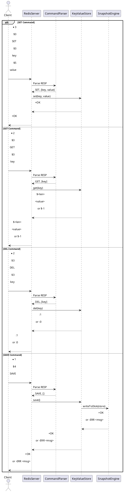

### Design Step Overview

The design phase involves:

1. **Refining the Architecture**: Define the system’s components and their interactions, building on the Component
   Diagram.
2. **Data Structures**: Specify the in-memory storage and persistence format, based on the Class Diagram.
3. **Interfaces and Protocols**: Design the client-server communication protocol (e.g., simplified RESP for `SET`,
   `GET`, `DEL`, `SAVE`).
4. **Command Processing**: Detail the logic for each command, extending the Sequence and Activity Diagrams.
5. **Persistence Mechanism**: Design the `SAVE` command’s file storage format, informed by the Activity Diagram.
6. **Diagrams**: Update or create design-level diagrams (e.g., refined Class Diagram, detailed Sequence Diagrams).
7. **Pseudocode**: Provide Python pseudocode for key components to bridge design and implementation.

### Step-by-Step Design Approach

#### 1. System Architecture

Based on the Component Diagram ([components.puml](../analysis/diagrams/components.puml)), the Redis clone will have the
following components:

- **Client Interface**: A TCP server to receive commands from clients.
- **Command Parser**: Interprets commands (`SET`, `GET`, `DEL`, `SAVE`) using a simplified Redis Serialization
  Protocol (RESP).
- **KeyValueStore**: Manages in-memory key-value data (strings only, for simplicity).
- **SnapshotEngine**: Handles saving data to a file for the `SAVE` command.

**Design Decisions**:

- Use Python’s `socket` library for the TCP server (Client Interface).
- Implement a simplified RESP parser (e.g., handle basic commands like
  `*2\r\n$3\r\nSET\r\n$3\r\nkey\r\n$5\r\nvalue\r\n`).
- Store data in a C++ hash map (`std::unordered_map`) for `KeyValueStore`.
- Save data to a text file (key-value pairs) for `SnapshotEngine`.

#### 2. Data Structures

Based on the Class Diagram ([class_diagram.puml](diagrams/class_diagram.puml)), the primary data structures are:

- **KeyValueStore**: A C++ `std::unordered_map` mapping strings to strings (`{key: value}`).
- **SnapshotEngine**: Writes the `std::unordered_map` to a text file in a simple format (e.g., `key:value\n` per line).

**Design Decisions**:

- Use `std::unordered_map` for fast O(1) lookups, insertions, and deletions.
- For `SAVE`, serialize the `std::unordered_map` to a text file with one key-value pair per line (e.g., `key1:value1\nkey2:value2\n`).
- No expiration or advanced data types (e.g., lists, sets) to keep the scope minimal.

**Updated Class Diagram** (refined for design):
[class_diagram.puml](diagrams/class_diagram.puml)

#### 3. Client-TcpServer Protocol

Redis uses RESP (Redis Serialization Protocol) for client-server communication. For simplicity, we’ll design a minimal
RESP parser supporting `SET`, `GET`, `DEL`, and `SAVE`.

**Design Decisions**:

- **Command Format**:
    - `SET key value`: `*3\r\n$3\r\nSET\r\n$<len>\r\nkey\r\n$<len>\r\nvalue\r\n`
    - `GET key`: `*2\r\n$3\r\nGET\r\n$<len>\r\nkey\r\n`
    - `DEL key`: `*2\r\n$3\r\nDEL\r\n$<len>\r\nkey\r\n`
    - `SAVE`: `*1\r\n$4\r\nSAVE\r\n`
- **Responses**:
    - `OK`: `+OK\r\n`
    - Value (for `GET`): `$<len>\r\n<value>\r\n` or `$-1\r\n` (nil).
    - Integer (for `DEL`): `:<number>\r\n`
    - Error: `-ERR <message>\r\n`
- Parser will split input by `\r\n`, validate command structure, and extract arguments.

**Pseudocode for Command Parser**:

```python
class CommandParser:
    def parse(self, resp_data):
        # Split RESP data by \r\n
        tokens = resp_data.split("\r\n")
        if not tokens[0].startswith("*"):
            return None, "Invalid RESP format"
        
        # Extract command and arguments
        arg_count = int(tokens[0][1:])
        if len(tokens) < 1 + 2 * arg_count:
            return None, "Incomplete RESP data"
        
        command = tokens[2][1:].upper()  # e.g., SET, GET
        args = [tokens[i][1:] for i in range(4, 4 + 2 * (arg_count - 1), 2)]
        return command, args
```

#### 4. Command Processing

Each command’s logic is detailed below, extending the Sequence Diagram (artifact_id:
`08266558-3d37-47e5-9ae2-d2b65af92bea`) and Activity Diagram for `SAVE` (artifact_id:
`7acdc0ca-5b2f-4d0c-bb41-79b0320bd495`).

- **SET key value**:
    - Store `key: value` in the `KeyValueStore`’s `std::unordered_map`.
    - Return `+OK\r\n`.
- **GET key**:
    - Retrieve value for `key` from `std::unordered_map`.
    - Return `$<len>\r\n<value>\r\n` or `$-1\r\n` if key doesn’t exist.
- **DEL key**:
    - Remove `key` from `std::unordered_map` if it exists.
    - Return `:1\r\n` (deleted) or `:0\r\n` (not found).
- **SAVE**:
    - Serialize `std::unordered_map` to a text file via `SnapshotEngine`.
    - Return `+OK\r\n` on success or `-ERR <message>\r\n` on failure.

**Pseudocode for KeyValueStore**:

```python
class KeyValueStore:
    def __init__(self):
        self.store = {}
        self.persistence = SnapshotEngine("data.txt")

    def set(self, key, value):
        self.store[key] = value
        return "+OK\r\n"

    def get(self, key):
        if key in self.store:
            value = self.store[key]
            return f"${len(value)}\r\n{value}\r\n"
        return "$-1\r\n"

    def del(self, key):
        if key in self.store:
            del self.store[key]
            return ":1\r\n"
        return ":0\r\n"

    def save(self):
        result = self.persistence.writeToDisk(self.store)
        return result
```

#### 5. Persistence Mechanism

Based on the Activity Diagram for `SAVE`, the persistence mechanism will:

- Serialize the `KeyValueStore`’s `std::unordered_map` to a text file.
- Format: One `key:value` pair per line (e.g., `key1:value1\nkey2:value2\n`).
- Handle I/O errors gracefully.

**Pseudocode for SnapshotEngine**:

```python
class SnapshotEngine:
    def __init__(self, file_path):
        self.file_path = file_path

    def writeToDisk(self, data):
        try:
            with open(self.file_path, 'w') as f:
                for key, value in data.items():
                    f.write(f"{key}:{value}\n")
            return "+OK\r\n"
        except IOError as e:
            return f"-ERR Failed to save: {str(e)}\r\n"
```

#### 6. Client Interface (TCP TcpServer)

The server will listen for client connections, receive RESP commands, and dispatch them to the parser and store.

**Pseudocode for Client Interface**:

```python
import socket

class RedisServer:
    def __init__(self, host="localhost", port=6379):
        self.store = KeyValueStore()
        self.parser = CommandParser()
        self.host = host
        self.port = port

    def start(self):
        server_socket = socket.socket(socket.AF_INET, socket.SOCK_STREAM)
        server_socket.bind((self.host, self.port))
        server_socket.listen(5)
        
        while True:
            client_socket, addr = server_socket.accept()
            data = client_socket.recv(1024).decode()
            command, args = self.parser.parse(data)
            
            if command == "SET" and len(args) == 2:
                response = self.store.set(args[0], args[1])
            elif command == "GET" and len(args) == 1:
                response = self.store.get(args[0])
            elif command == "DEL" and len(args) == 1:
                response = self.store.del(args[0])
            elif command == "SAVE" and len(args) == 0:
                response = self.store.save()
            else:
                response = "-ERR Invalid command\r\n"
                
            client_socket.send(response.encode())
            client_socket.close()
```

#### 7. Detailed Sequence Diagram

To reflect the design, here’s an updated Sequence Diagram for all commands, showing the interaction between the TCP
server, parser, store, and persistence manager.



### Design Summary

- **Architecture**: TCP server (`RedisServer`) with a parser (`CommandParser`), in-memory store (`KeyValueStore`), and
  file-based persistence (`SnapshotEngine`).
- **Data Structures**: Python `std::unordered_map` for storage, text file for persistence (`key:value\n` format).
- **Protocol**: Simplified RESP for commands and responses.
- **Command Logic**: `SET` (store key-value), `GET` (retrieve value), `DEL` (delete key), `SAVE` (persist to file).
- **Diagrams**: Updated Component, Class, and Sequence Diagrams to reflect design details.
- **Pseudocode**: Provided for all components, ready for Python implementation.

### Next Steps

- **Review Design**: Ensure the architecture and data structures meet your course requirements. If you need features
  like expiration or additional commands, I can extend the design.
- **Implement**: Translate the pseudocode into Python code. I can provide a complete Python file if needed.
- **Diagrams**: Include the updated diagrams in your design documentation, explaining how they support `SET`, `GET`,
  `DEL`, and `SAVE`.
- **Testing Plan**: Design test cases (e.g., send RESP commands via a client like `telnet` to verify responses).
- **Further Assistance**:
    - Want a full Python implementation based on this design?
    - Need additional diagrams (e.g., Deployment Diagram for the server)?
    - Want help embedding this design in your `README.md`?
